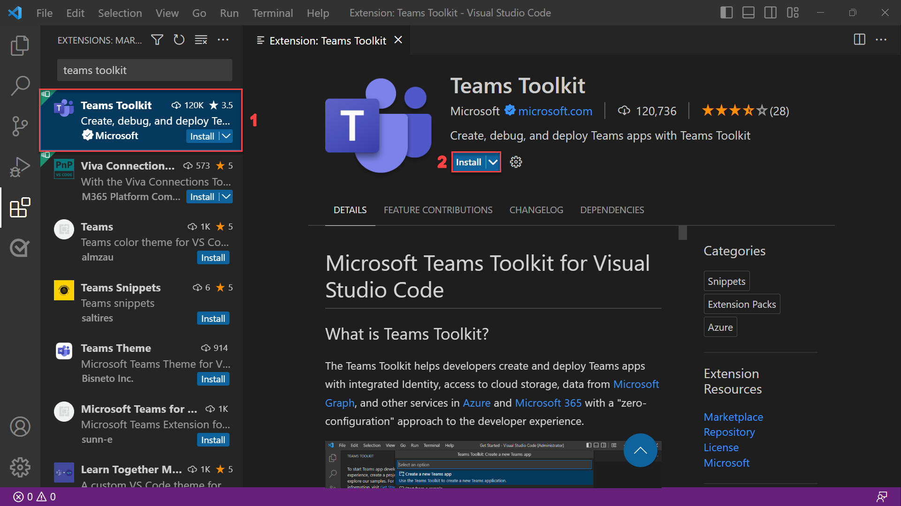

# 演習 1:Teams Toolkit for Visual Studio Code をインストールして設定する

この演習では、Teams Toolkit for Visual Studio Code をインストールし、環境を設定します。

## タスク 1:Teams Toolkit for Visual Studio Code をインストールする

1. **Visual Studio Code** を開きます。
2. サイドバーから**拡張機能**アイコンを選択します。
3. 検索バーを使用して、**[拡張機能]** セクションで "Teams Toolkit" を検索します。 その後、 **[インストール]** を選択します。

**注**:このモジュールの演習では、Teams Toolkit v5.0.0 を使用します。

[Visual Studio Marketplace](https://marketplace.visualstudio.com/items?itemName=TeamsDevApp.ms-teams-vscode-extension) から Teams Toolkit をインストールすることもできます。

## タスク 2:Microsoft 365 の職場または学校アカウントを準備する

開発とテストに適した Microsoft 365 の職場または学校アカウントへの管理者アクセス権が既にある場合は、そのアカウントを使用してアプリを実行およびデバッグすることができます。 実際のユーザーに影響を与えることなく、操作を安全に実行できるテナントを使用してください。

そうしない場合は、[Microsoft 365 開発者プログラム](https://aka.ms/m365developers)を使用して、無料のテスト アカウントを作成することもできます。  セットアップが完了すると、Teams アプリの構築に使用できるテナントへの管理者アクセス権が、Microsoft 365 開発者プログラムによって提供されます。

## タスク 3:Teams 用アプリをアップロードするように Microsoft 365 テナントを構成する

次の手順に従って、テナントのカスタム アプリのアップロードを有効にします。

1. **Microsoft 365 管理者の資格情報**を使用して、[Microsoft Teams 管理センター](https://admin.teams.microsoft.com)にサインインします。

2. サイドバーから **[Teams アプリ]**、**[セットアップ ポリシー]** の順に選択します。

3. **グローバル (組織全体の既定) ポリシー**を選択し、**カスタム アプリのアップロード**の切り替えをオンにします。

   

4. **保存**ボタンを選択して、変更を保存します。 これで、カスタム アプリのサイドローディングを許可するようにテナントが構成されました。

次のレッスンでは、Teams アプリを作成し、Teams でローカルに実行する方法について説明します。
