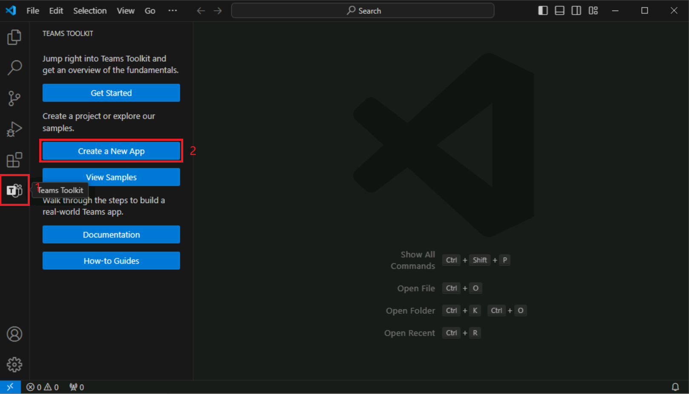
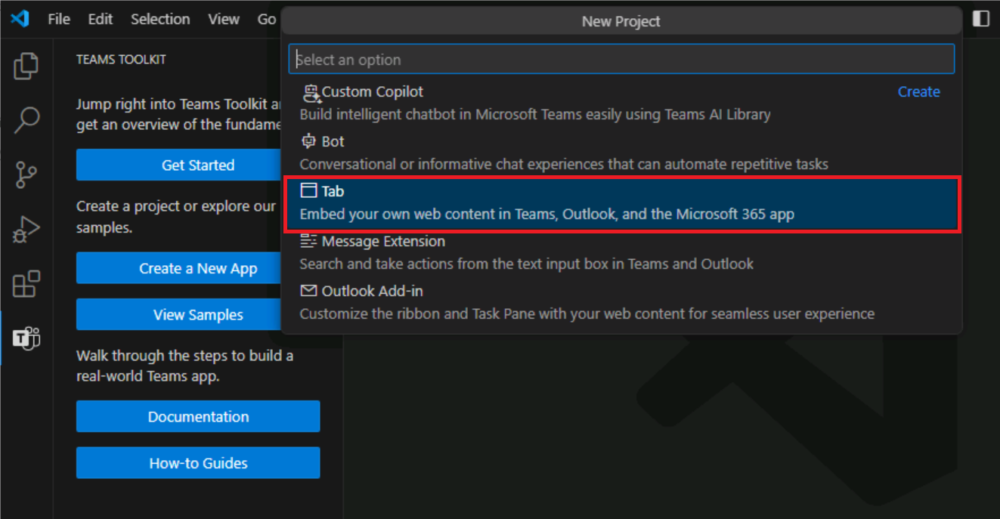

# 演習 2:Teams Toolkit を使用して Teams アプリを作成する

Teams Toolkit for Visual Studio Code には、新しいアプリを作成するための方法が 2 つ用意されています。 ツールキットによって提供される組み込みのテンプレートを使用して、新しいアプリを作成できます。 さらに、Teams Toolkit for Visual Studio Code には、ユーザーがベースとなるアプリを検討して作成するためにすぐ利用できるサンプルのコレクションが用意されています。 

この演習では、組み込みのテンプレートを使用して初めての Microsoft Teams アプリを作成します。

## タスク 1:新しい Teams アプリを作成する

1. Visual Studio Code サイド バーで、**[Teams Toolkit]** ボタンを選択して Teams Toolkit を開きます。
1. Teams Toolkit で、**[新しいアプリの作成]** を選択します。

   

1. [新しいプロジェクト] メニューの **[タブ]** を選択します。

   
   
1. 機能を選択するように求められたら、**[基本タブ]** を選択します。
1. プログラミング言語の選択を求められたら、**[TypeScript]** を選択します。
1. フォルダーの選択を求められたら、**[既定のフォルダー]** を選択するか、別のファイルの場所を選択します。
1. 基本タブ アプリの任意の**アプリケーション名を入力**し、**Enter** キーを押します。
1. Teams Toolkit によって新しいアプリの準備が行われ、Visual Studio Code でプロジェクト フォルダーが開かれます。
1. Visual Studio Code から、このフォルダー内のファイルの作成者を信頼するかどうかを確認するメッセージが表示される場合があります。 **[はい、作成者を信頼します]** ボタンを選んで、続行します。

   ![[作成者を信頼する] のスクリーンショット](../../media/trust-authors.png)

1. これで、以下を含むプロジェクト コードを表示できるようになりました。

- Teams アプリ コード。
- appPackage フォルダー内のデプロイおよびマニフェスト ファイル。
- env フォルダー内の環境変数。
- アプリの実行、デバッグ、デプロイに必要な手順が記載された README ファイル。

  
