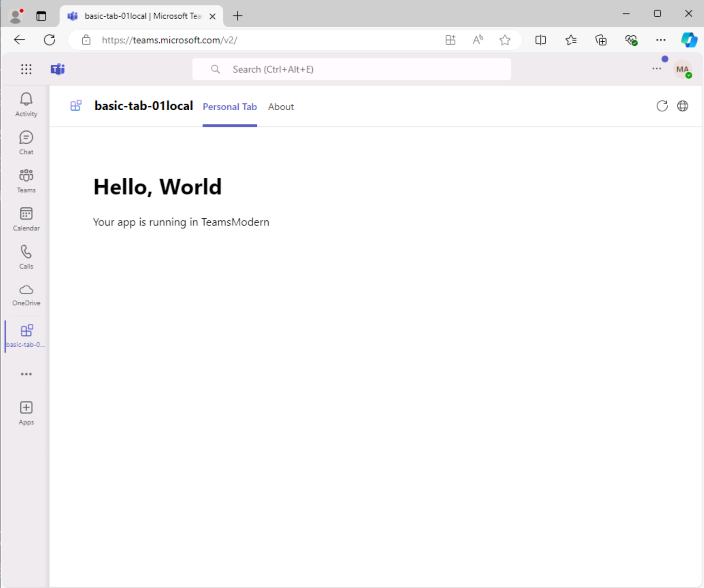

# 演習 3:Teams アプリを実行する

この演習では、Teams アプリをローカルで実行します。

## タスク 1:Microsoft 365 にサインインする

1. Visual Studio Code で、**[Teams Toolkit]** を開き、**[Sign in to Microsoft 365]\(Microsoft 365 にサインインする\)** を選びます。

    

2. ポップアップ ダイアログで、**[サインイン]** を選びます。 **Microsoft 365 アカウントの資格情報**でサインインするためのブラウザーが開きます。  管理者資格情報を入力します。

3. 正常にサインインしたら、ブラウザーを閉じて Visual Studio Code に戻ります。 Teams Toolkit のアカウントの下に、テナントが適切に構成されたことを示す **[カスタム アプリ アップロードの有効化]** メッセージが表示されます。

    

## タスク 2:アプリをローカルで実行する

プロジェクトを実行し、Microsoft Teams でどのように見えるか確認してみましょう。

1. サイドバーで、**[デバッグ]** アイコンを選び、**[実行とデバッグ]** パネルを開きます。
2. **[実行とデバッグ]** パネルで、ボットのデバッグに使用するブラウザーとして **[Chrome]** または **[Edge]** のいずれかをドロップダウン リスト ボックスから選びます。  次に、**[再生]** ボタン (または **F5** キー) を選んで、デバッグ セッションを開始します。
3. Teams Toolkit で前提条件チェックが実行されます (1 分から 2 分かかる場合があります)。
4. 次に、Teams Toolkit で、選択したブラウザーで Microsoft Teams が開かれます。
5. Teams Toolkit へのサインインに使用したのと同じ **Microsoft 365** アカウントでサインインします。
6. その後、アプリをインストールするオプションが Teams に表示されます。 **[追加]** を選んで、アプリをプレビューします。

    

7. プレビュー中は、アプリの名前に *local* というサフィックスが付きます。 このサフィックスは、アプリがローカルで実行されていて、デプロイされていないことを示します。

    

8. プロジェクト構造とアプリの使用およびカスタマイズ方法の詳細については、プロジェクト フォルダーにある **README.md** ファイルを開いてご確認ください。

これで、サンプルから Teams アプリを作成し、ローカルで実行しました。
