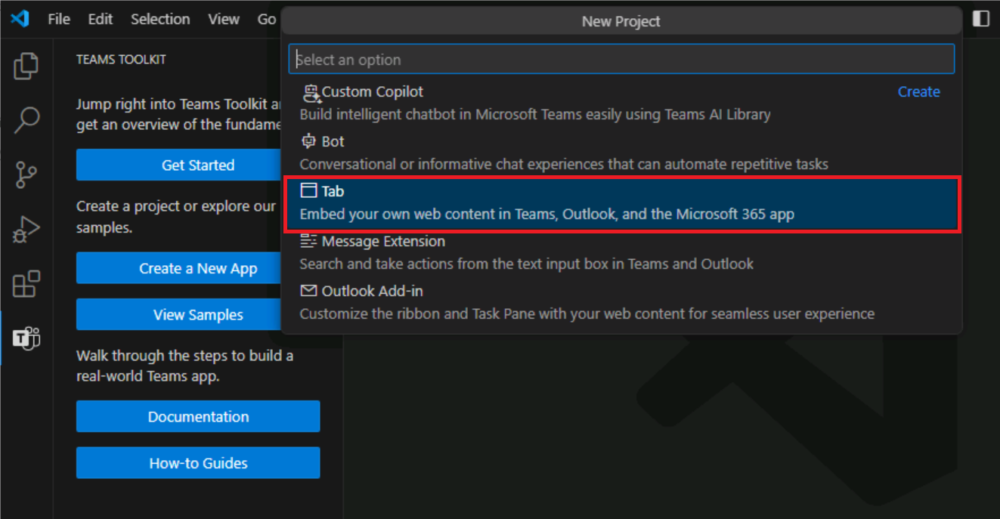
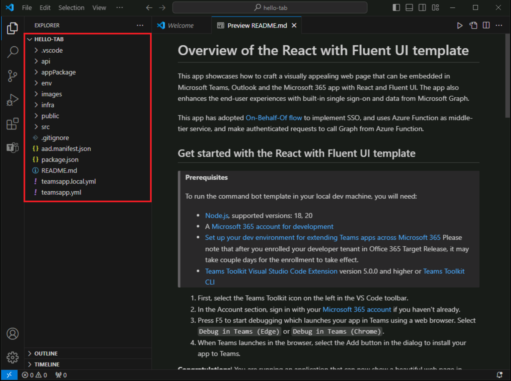

# 演習 1:Teams タブ アプリをホストする Azure リソースを作成する

この演習では、まず、Teams Toolkit for Visual Studio Code を使用して Teams タブ アプリを作成してプロビジョニングします。 後の演習では、Azure でホストするアプリを設定します。

**注**:このトレーニング モジュールの演習では、Teams Toolkit v5.0.0 を使用します。 次の手順では、Teams Toolkit 拡張機能がインストールされていることを前提としています。

## タスク 1:新しいタブ アプリを作成する

1. Visual Studio Code のアクティビティ バーで、**[Microsoft Teams]** アイコンを選びます。

1. Teams Toolkit パネルで、**[新しいアプリの作成]** ボタンを選択します。

1. [オプション] で **[タブ]** を選択します。

    

1. 次に、**[Fluent UI で対応する]** を選択します。

    

1. プログラミング言語のオプションから、**[JavaScript]** を選択します。

1. タブ アプリ プロジェクト フォルダーとそのすべてのファイルの**場所**を選択します。

1. アプリケーション名に「**hello-tab**」と入力し、Enter キーを押します。

1. プロジェクトのスキャフォールディングが開始されます。 プロジェクトがスキャフォールディングされると、新しいプロジェクトが読み込まれた新しい Visual Studio Code ウィンドウが開きます。

    

1. Visual Studio Code で、**[実行] > [デバッグの開始]** を選択するか、**F5** キーを押してデバッグ セッションを開始します。

1. Visual Studio Code によってアプリケーションが構築され開始されます。 Azure リソースのプロビジョニングを開始する前に、デバッグ セッションを実行します。

1. アプリが正常にテストされたら、アプリのローカルでの実行を停止します。

1. デバッグ セッションを終了してアプリの実行を停止するには、ブラウザーを閉じるか、**[実行] > [デバッグの停止]** を選択するか、**Shift + F5** キーを押します。

## タスク 2:Teams Toolkit で Azure にサインインする

お使いの **Azure サブスクリプション**を使用して、Azure にサインインします。

1. アクティビティ バーで、**[Microsoft Teams]** アイコンを選択します。

1. [Teams Toolkit] パネルの **[アカウント]** で、**[Azure にサインイン]** を選択します。

    ![Azure にサインインするためのボタンが表示された [Teams Toolkit] パネルのスクリーンショット。](../../media/sign-into-azure.png)

1. 表示されるダイアログで、**[サインイン]** を選択します。

    

## タスク 3:リソースをプロビジョニングする

これで、Teams タブ アプリに必要なリソースをプロビジョニングできます。

1. Teams Toolkit パネルの **[ライフサイクル]** で **[プロビジョニング]** を選択します。

    ![[デプロイ] セクションの [クラウドでのプロビジョニング] オプションが強調表示されているスクリーンショット。](../../media/provision-start.png)

1. 次に、**[リソース グループを選択します]** メニューの **[新しいリソース グループ]** オプションを選択して、リソースをプロビジョニングしたり、新しいリソース グループを作成したりできるリソース グループを選択する必要があります。

    

1. このツールでは、rg-hello-tab0989fd-dev などのリソース グループ名を自動的に提案します。 **Enter** キーを押します。

1. 次に、新しいリソース グループに **[場所: 米国東部]** を選択し、**Enter** を選択します。

1. 選択内容を確認するダイアログで、**[プロビジョニング]** を選択します。

    

1. プロビジョニングは、Azure で Teams タブ アプリをホストするために必要なすべてのリソースに対して開始されます。 プロビジョニングには時間がかかる場合があります。

これで、Teams タブ アプリケーションをホストするために必要なすべてのリソースが正常にプロビジョニングされました。

次に、アプリのソース コードをこれらのリソースにデプロイします。
