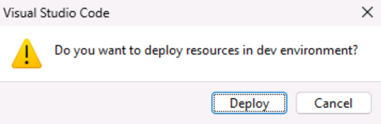
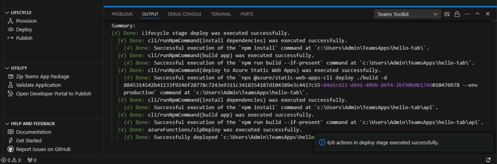

# 演習 2:アプリのソース コードをデプロイする

この演習では、プロビジョニングされた Azure リソースにソース コードをデプロイします。

## タスク 1:Teams ツールキットを使用してデプロイする

1. Visual Studio Code のアクティビティ バーで、**Teams ツールキット アイコン**を選択します。

2. Teams ツールキット パネルの **[ライフサイクル]** で **[デプロイ]** を選択します。

    

3. デプロイの確認ダイアログで、**[デプロイ]** を選択します。

    .

4. Visual Studio Code エディターでデプロイが成功したことを確認します。

    

Teams タブ アプリのコードは、Azure Storage で正常にホストされ、Teams に発行する準備が整いました。

次の演習では、Teams アプリを発行する方法について学びます。
