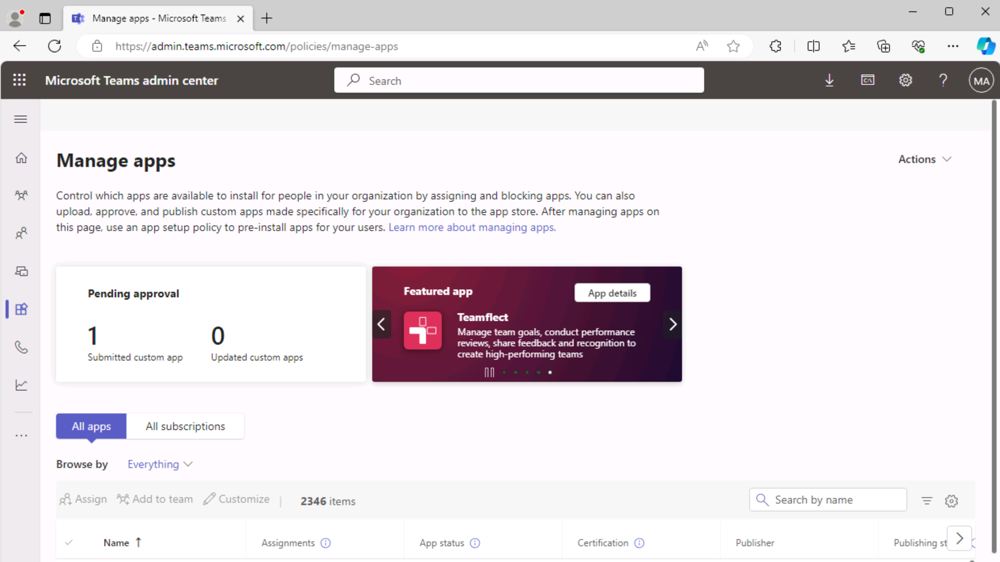
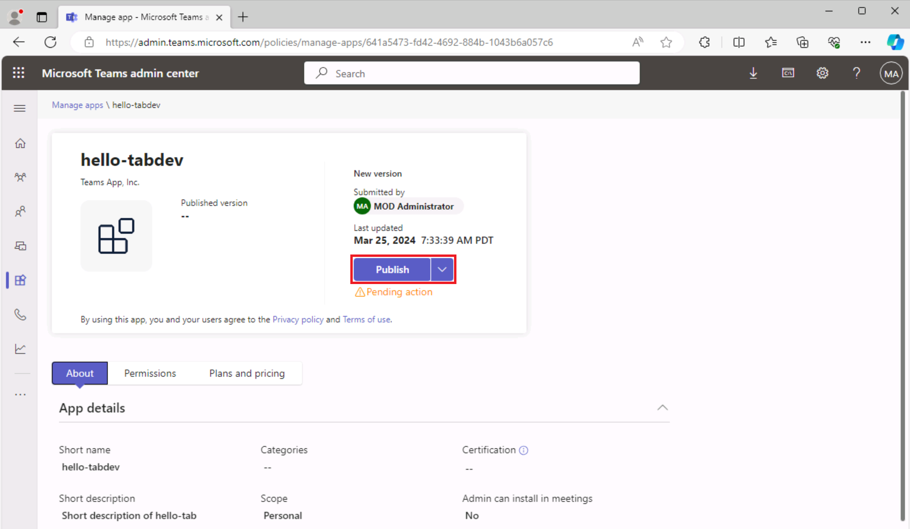

# 演習 3:Teams タブ アプリを発行する

この演習では、アプリを組織ストアに発行する方法について説明します。

## タスク 1:アプリをストアに発行する

1. Visual Studio Code のアクティビティ バーで、**Microsoft Teams アイコン**を選び、**Teams ツールキット パネル**を開きます。

    ![Teams ツールキット パネルが開き、[Teams への発行] オプションが強調表示されているスクリーンショット。](../../media/publish-to-teams.png)

1. Teams ツールキット パネルの **[ライフサイクル]** で **[発行]** を選びます。

1. ダイアログには、アプリが Microsoft Teams 管理ポータルに正常に発行されたことが表示されます。

1. ダイアログで **[管理ポータルに移動]** を選び、**Microsoft Teams 管理センター**を開きます。  **Microsoft 365 テナント アカウント**でサインインします。

    a. 

    b. 

1. Teams 管理センターの **[アプリの管理]** メニュー内で、**[名前で検索]** テキストボックスを見つけます。 
1. 「**hello-tabdev**」と入力して、アプリの一覧をフィルター処理します。 次に、**アプリを選んで**アプリの詳細を表示します。

    

1. **hello-tabdev** アプリの詳細パネルで、**[発行]** を選びます。

    

1. **[カスタム アプリを発行しますか?]** ダイアログで、**[発行]** を選びます。

1. 緑色のバナーは、hello-tab アプリが発行されたことを示します。

    

アプリが組織ストアで発行されたら、Microsoft Teams を開き、組織ストアからアプリをインストールします。

## タスク 2:ストアからアプリをインストールする

1. Microsoft Teams クライアントを開くか、**Microsoft 365 テナントの資格情報**を使用して Microsoft Teams オンライン ([teams.microsoft.com](teams.microsoft.com)) にサインインします。
2. Microsoft Teams で **[アプリ]** に移動し、組織ストアを表示します。 **[組織用に構築]** で、**[hello-tabdev]** タイルを選びます。

    a. 

3. アプリのインストール ダイアログで、**[追加]** を選びます。

    a. 

4. アプリが開き、"**お使いのアプリは Azure 環境で実行されています**" というメッセージが表示されます。

    
