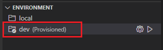
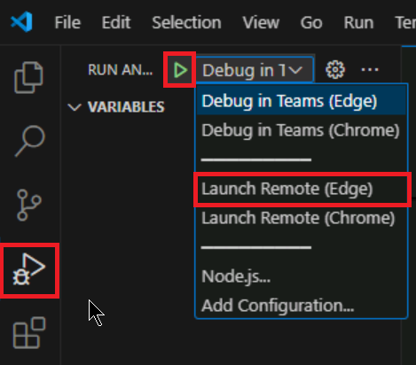
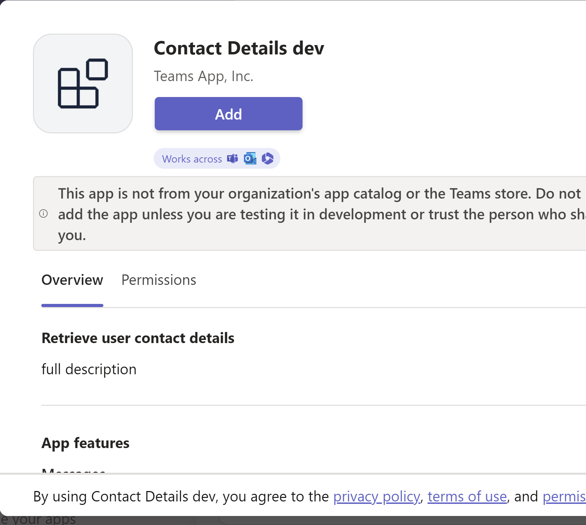

---
lab:
  title: Microsoft Graph からデータを取得するメッセージ拡張機能を実装する
  module: Exercise 1
---

# 演習 1:Microsoft Graph からデータを取得するメッセージ拡張機能を実装する

## シナリオ

あなたは、チーム メンバーがユーザーの連絡先情報を取得し、カードを使用して Teams のメッセージに連絡先の詳細を挿入できるようにするメッセージ拡張機能の構築について IT サポート チームを支援するよう求められているとします。  この演習では、Microsoft Graph からユーザー データを取得するメッセージ拡張機能を実装します。  ソリューションは既に Teams Toolkit を使用してスキャフォールディングされていますが、機能を実装するにはいくつかの変更を加える必要があります。

## 演習タスク

ここでの目標は、アプリが次の機能を持つようにすることです:


- アプリ ユーザーは、メッセージ拡張機能 UI にユーザーの名前を入力します。
- アプリは Graph API の `users` エンドポイントを使用して、表示名でユーザーを検索し、結果を一覧表示します。
- アプリ ユーザーは、検索結果から目的のユーザーを選択する際、Teams のメッセージに目的のカードを挿入できます。
- カードには、ユーザーの表示名、メール アドレス、電話番号が表示されます


この演習を完了するには、次のタスクを実行する必要があります。

1. プロジェクトにアクセスして確認します。
2. 検索機能を完成させます。
3. Graph クエリを追加します。
4. メッセージ拡張機能のリソースをプロビジョニングします。
5. Microsoft Graph にアクセスするためのアクセス許可を構成します。
6. Azure にデプロイ。
7. アプリを実行してテストする。

**推定完了時間:** 25 分

## タスク 1:プロジェクトにアクセスして確認する

メッセージ拡張機能アプリは、Teams Toolkit を使用してスキャフォールディングされています。  このアプリは、Microsoft Graph JavaScript クライアント ライブラリを使用して Microsoft Graph からユーザー データを取得するように更新されました。  コードの一部が不完全な状態です。

1. [Starter](https://github.com/MicrosoftLearning/APL-4001-Build-collaborative-apps-for-Microsoft-Teams/tree/master/Allfiles/Labs/Starter) フォルダーから [ContactDetails.zip](https://github.com/MicrosoftLearning/APL-4001-Build-collaborative-apps-for-Microsoft-Teams/raw/master/Allfiles/Labs/Starter/ContactDetails.zip) プロジェクトをダウンロードします。
2. マシン上の **ContactDetails** という名前のフォルダーに ZIP ファイルの内容を抽出し、Visual Studio Code でフォルダーを開きます。  
3. Visual Studio Code の Explorer 領域にあるプロジェクト ディレクトリとファイルを確認して、ソース コードについて理解します。  主なファイルとフォルダーは次のとおりです:

| フォルダー/ファイル | 内容 |
| --- | --- |
| `teamsapp.yml` | メインのプロジェクト ファイルは、アプリケーションの構成を記述し、各ライフサイクル ステージで実行するアクションのセットを定義します。 |
| `teamsapp.local.yml` | これは、ローカルでの実行とデバッグを有効にするアクションで `teamsapp.yml` をオーバーライドします。 |
| `.vscode/` | ローカル デバッグ用の VSCode ファイル。 |
| `appPackage/` | Teams アプリ マニフェストを含むアプリ パッケージ ファイル。 |
| `infra/` | Azure リソースをプロビジョニングするためのテンプレート。 |
| `index.js` | アプリケーション エントリ ポイントと `restify` ハンドラー。 |
| `teamsBot.js` | Teams アクティビティ ハンドラー。  |

## タスク 2:検索機能を完成させる

このソリューションには、Graph クエリで使用する検索クエリ文字列の値を格納するためのコードがありません。  この値を `searchQuery` という名前の変数に格納するようにコードを更新します。

1. **TeamsBot.ts** ファイルに移動します。
2. `handleTeamsMessagingExtensionQuery` メソッドで、**[// Get the search context from the query parameters]\(クエリ パラメーターから検索コンテキストを取得します\)** というコメントを見つけます。 81 行目で、次の行に以下のコード行を追加します。

    ```JavaScript
    const searchQuery = query.parameters[0].value;
    ```

## タスク 3:Graph クエリを更新する

このソリューションには、検索文字列を使用する Graph クエリの API パスがありません。  表示名でユーザーを検索するために `$search` を使用するようにクエリを更新します。

1. `handleTeamsMessagingExtensionQuery` 関数で、84 行目にある次のコメントを見つけます。

      `// Use the Graph API to search for users by their display name.`

2. 次のコード行で、`path` を以下の API パスに置き換えます。

     ```TypeScript
     /users?$search="displayName:${searchQuery}"&$count=true
     ```

これで、コードは機能要件を満たすはずです。

## タスク 4:メッセージ拡張機能のリソースをプロビジョニングする

次に、Teams Toolkit を使用して、メッセージ拡張機能に必要なリソースをプロビジョニングします。

> 注: Azure クラウド リソースをプロビジョニングして Azure にデプロイすると、Azure サブスクリプションで料金が発生する可能性があります。

1. Visual Studio コードで、サイドバーから **[Teams ツールキット]** を選択します。
2. **[アカウント]** の下で、Microsoft 365 テナントと **Azure アカウント**にサインインします。
3. **[ライフサイクル]** で、**[プロビジョニング]** を選択します。
    
4. リソースをプロビジョニングできるリソース グループを選択するか、**[新しいリソース グループ]** オプションを選択し、プロンプトに従うことにより、新しいリソース グループを作成します。  
    ![Teams Toolkit の [リソース グループの選択] メニューのスクリーンショット。](../../media/new-resource-group.png)
5. 選択を確認する最後のダイアログで、**[プロビジョニング]** を選択します。

    プロビジョニングが完了すると、Teams Toolkit の `dev` 環境を使用して、Microsoft 365 テナントに新しいアプリ登録が作成されます。 プロビジョニングには時間がかかる場合があります。

    

## タスク 5:Microsoft Graph データを取得するためのアクセス許可を構成する

1. [portal.azure.com](portal.azure.com) で、**Microsoft 365** 管理者アカウントを使用して Azure portal にサインインします。
2. 左側のナビゲーション メニューで、**Microsoft Entra ID** に移動します。
3. **[管理] > [アプリの登録] > [すべての登録]** に移動します。
4. プロビジョニング中に作成された **ContactDetails** アプリの登録を選択します。
5. **[管理] > [API のアクセス許可]** に移動します。
6. **[+アクセス許可の追加]** を選択します。
7. **Microsoft Graph** を選択します。
8. **デリゲートされたアクセス許可**を選択します。
9. **[ユーザー]** の下に一覧表示されているアクセス許可を検索して、**[User.Read.All]** アクセス許可を選択します。
    
10. **[アクセス許可の追加]** ボタンを選択します
11. アクセス許可は構成されましたが、管理者の同意が必要です。
    ![Azure Portal の [構成されたアクセス許可] ビューのスクリーンショット。](../../media/configured-permissions-consent.png)
12. **[[テナント] に管理者の同意を与えます]** を選択してから、**[はい]** を選択して確認します。

アクセス許可が構成され、同意されました。

## タスク 6:Azure にデプロイする

`dev` 環境内のプロビジョニングされたリソースにアプリをデプロイします。

1. Teams Toolkit パネルの **[ライフサイクル]** で **[デプロイ]** を選択します。
2. デプロイの確認ダイアログで、**[デプロイ]** を選択します。
3. Visual Studio Code エディターでデプロイが成功したことを確認します。

メッセージ拡張機能は Azure でホストされています。

## 作業を確認

Teams クライアントでアプリをプレビューして、機能をテストします。

1. Teams Toolkit パネルの **[開発]** で、**[Preview Your Teams App (F5)]\(Teams アプリのプレビュー (F5)\)** を選択します。
2. ドロップダウン メニューで、任意のブラウザーで **[Launch Remote]\(リモート起動\)** するための目的のオプションを選択します。

    

3. アプリを初めて実行するときに、すべての依存関係がダウンロードされ、アプリがビルドされます。 ビルドが完了すると、ブラウザー ウィンドウが開きます。 このプロセスが完了するまでに 3分から 5 分かかることがあります。
4. Teams に、アプリの説明とアクセス許可の要件が記載されたウィンドウが表示されます。  **[追加]** を選択して、アプリを追加します。

    

5. メッセージ拡張機能が Teams クライアントに読み込まれたら、表示名でユーザーを検索するために文字を入力します。  結果を選択して、カードを会話に挿入します。

注: 何らかの理由でメッセージ拡張機能が自動的に呼び出されない場合は、Teams クライアントの上部またはメッセージ作成領域にあるコマンド バーに「@Contact Details dev」と入力することによりアクセスできます。  メッセージ作成領域の **[Actions and apps]\(アクションとアプリ\)** ボタンを使用して、アプリを見つけることもできます。
