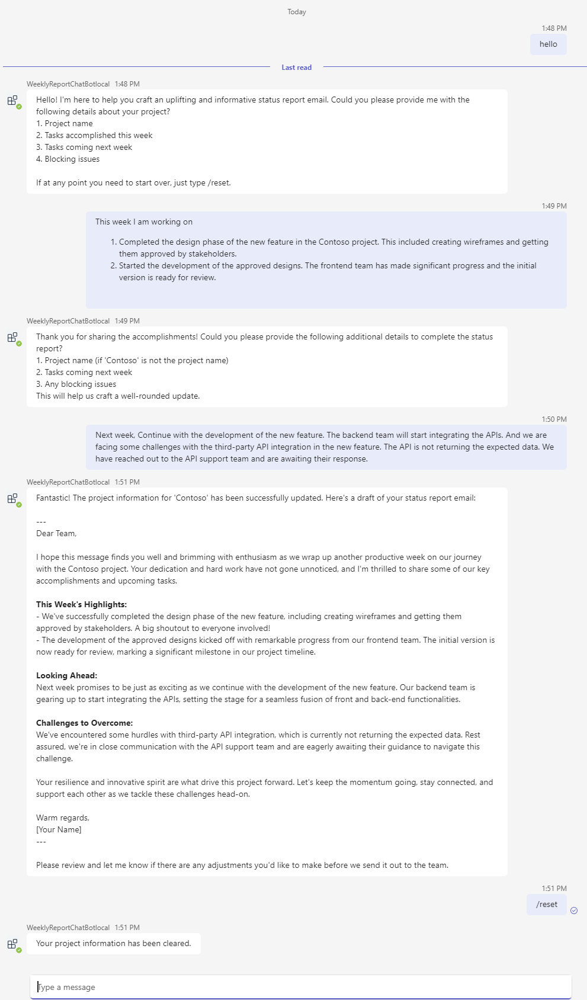

---
lab:
  title: AI を使用してボットを構築する
  module: Exercise 4
---

# 演習 4: AI を使用してボットを構築する

## シナリオ

IT サポート チームのメンバーだとします。 週次レポートをコンパイルすることは非常に機械的で時間のかかるプロセスであることを認識しています。 MS Teams 内に AI ボットを作成したいと考えています。 ボットとの会話で、週次の作業項目やタスクについて話し合うだけで、フォーマットの整った週次レポートを生成できます。 これにより、作業効率が大幅に向上する可能性があります。

## 演習タスク

この演習を完了するには、以下のタスクを実行する必要があります。

1. Teams AI ライブラリを使用してボットを作成する
1. OpenAI Service に接続する
1. コード機能を実装する
1. プロンプトを更新する

**推定所要時間:** 20 分

## 前提条件

ローカル開発マシンで AI チャット ボット テンプレートを実行するには、前のラボで説明したリソース要件を満たす必要があるだけでなく、OpenAI アカウントも必要です。 このアカウントは、[[OpenAI]](https://platform.openai.com/) または [[Azure OpenAI]](https://aka.ms/oai/access) からのものでもかまいません。

## タスク 1:Teams Toolkit を使用してボットを作成する

**目標:** Teams AI ライブラリを使用して新しいボット プロジェクトを設定し、プロジェクトの構造とファイルについて理解します。  

AI チャット ボット テンプレートを使用して、新しいボットを作成します。

1. Visual Studio Code を開きます。
1. サイドバーの **Microsoft Teams** アイコンを選んで、**[Teams ツールキット]** パネルを開きます。
1. **[新しいアプリを作成]** ボタンを選択します。
1. **[新しいプロジェクト]** メニューから、**[カスタム Copilot]** を選択した後、**[基本的な AI チャットボット]** を選択してコマンド ボットを構築します。
1. [プログラミング言語] では、**[TypeScript]** を選択します。
1. **大規模言語モデル (LLM) のサービス**の場合は、LLM アカウントに基づいて **[Azure OpenAI]** または **[OpenAI]** を選択します。
1. **[Enter]** キーを押して、最初に大規模言語モデル (LLM) の設定をスキップします。 次の手順で [OpenAI] キーを設定します。
1. **[ワークスペース フォルダー]** では、プロジェクト ファイルを保存するためのコンピューター上のフォルダーを選択するか作成します。
1. **アプリケーション名**に「**WeeklyReportChatBot**」と入力し、**[Enter]** を押します。 Teams Toolkit によって新しいアプリの準備が行われ、Visual Studio Code でプロジェクト フォルダーが開かれます。
1. Visual Studio Code から、このフォルダー内のファイルの作成者を信頼するかどうかを確認するメッセージが表示される場合があります。 **[はい、作成者を信頼します]** ボタンを選んで、続行します。
1. Visual Studio Code のエクスプローラーを使用してプロジェクトのディレクトリとファイルを確認し、ソース コードを理解します。

## タスク 2: OpenAI Service に接続する

**目標:** 必要な API キーとエンドポイントを設定して、OpenAI を直接使用するか、Azure OpenAI を使用して OpenAI Service に接続するようにボットを構成します。  

### OpenAI アカウントを使用する
1. `env` フォルダーのファイル `.env.local.user` を開きます。
1. ファイル *env/.env.local.user*で、OpenAI キー `SECRET_OPENAI_API_KEY=<your-key>` を入力します。
1. `src` フォルダーのファイル `app.ts` を開きます。
1. (省略可能) このデモではモデルの計画機能を使用するため、gpt-4 は既定の gpt-3.5 出力よりも大幅に改善されています。 ファイル *src/config.ts*で、 *openAIModelName* プロパティ値を `"gpt-3.5-turbo"` から `"gpt-4"` または `"gpt-4-turbo"` に更新します。

### Azure OpenAI ユーザー
1. `env` フォルダーのファイル `.env.local.user` を開きます。
1. ファイル *env/.env.local.user* で、Azure OpenAI キー `SECRET_AZURE_OPENAI_API_KEY=<azure-openai-api-key>`、Azure OpenAI エンドポイント `AZURE_OPENAI_ENDPOINT=<azure-openai-endpoint>` と Azure OpenAI デプロイ名 `AZURE_OPENAI_DEPLOYMENT_NAME=<azure-openai-deployment-name>` を入力します。

## タスク 3: コード機能を実装する

**目標:** app.ts ファイルを変更し、必要なインポートを追加し、ユーザーの操作を処理するための応答ロジックを実装することで、ボットのコア機能を開発します。  

1. ファイル *src/app/app.ts*を開きます。 このファイルは、次の手順に従って変更します。 最終的なファイルは、 [app.ts](../../../Allfiles/Labs/Guided-Exercise5/app.ts) で参照できます。
1. `botbuilder` から `TurnContext` インポートを追加する 
    ```typescript
    import { MemoryStorage, TurnContext } from "botbuilder";
    ```
1. `@microsoft/teams-ai` から `DefaultConversationState` インポートと `TurnState` インポートを追加する
    ```typescript
    // See https://aka.ms/teams-ai-library to learn more about the Teams AI library.
    import { Application, ActionPlanner, OpenAIModel, PromptManager, DefaultConversationState, TurnState } from "@microsoft/teams-ai";
    ```
1. *[AI コンポーネントの作成]* セクションの前のファイル *src/app.ts* で `ProjectInformation` インターフェイスと `ApplicationTurnState` 定義を追加します。
    ```typescript
    // Register project information item related handlers
    interface ProjectInformation {
      projectName: string;
      tasksAccomplished: string;
      tasksComing: string;
      blockingIssues: string;
    }

    // Strongly type the applications turn state
    interface ConversationState extends DefaultConversationState {
      greeted: boolean;
      projectInformation: ProjectInformation;
    }
    type ApplicationTurnState = TurnState<ConversationState>;

    // Create AI components
    ```
1. *[ストレージとアプリケーションを定義する]* セクションの後のファイル *src/app.ts* で、メッセージに対するボットの応答を追加します。
    ```typescript
    // List for /reset command and then delete the conversation state
    app.message('/reset', async (context: TurnContext, state: ApplicationTurnState) => {
      state.deleteConversationState();
      await context.sendActivity("Your project information has been cleared.");
    });

    // Define the method for updating project information
    app.ai.action("updateProjectInformation", async (context: TurnContext, state: ApplicationTurnState, parameters: ProjectInformation) => {
      const conversation = ensureStateInitialized(state);
      if (parameters){
        if (parameters.projectName) {
          conversation.projectInformation.projectName = parameters.projectName;
        }
        if (parameters.tasksAccomplished) {
          conversation.projectInformation.tasksAccomplished = parameters.tasksAccomplished;
        } 
        if (parameters.tasksComing) {
          conversation.projectInformation.tasksComing = parameters.tasksComing;
        }
        if (parameters.blockingIssues) {
          conversation.projectInformation.blockingIssues = parameters.blockingIssues;
        }
        return `Project information was updated. Think about your next action`;
      }
    });

    // This method is used to make sure that the conversation state is initialized.
    function ensureStateInitialized(state: ApplicationTurnState): ConversationState {
      if (state.conversation.projectInformation == undefined) {
        state.conversation.projectInformation = {
          projectName: "",
          tasksAccomplished: "",
          tasksComing: "",
          blockingIssues: "",
        };
      }
      return state.conversation;
    }
    ```

## タスク 4: 更新を求める

**目標:** ボットの会話プロンプトを調整し、週次レポートの生成における対話の品質と有効性を向上させるために関数呼び出しを作成します。

1. *src/prompts/chat* フォルダー内の`skprompt.txt` ファイルを更新します。  最終的なファイルは、[skprompt.txt](../../../Allfiles/Labs/Guided-Exercise5/skprompt.txt) で参照できます。
    ```txt
    You are a Teams Bot. Here is how you will act.
    Team Bot will adopt an encouraging and positive tone in all its interactions. This will be reflected in the creation of status report emails, ensuring that they are not only informative but also boost morale and foster a joyous team spirit. The language used will be engaging and supportive, aiming to excite and inspire the team while maintaining a professional undercurrent appropriate for the communication between a project manager and their team and stakeholders in a professional corporate setting. The Teams Bot will always ask for information from the user when it is not provided. 
    # Teams Bot will ask for the following project information to make status report emails:
    1. project name
    2. tasks accomplished this week
    3. tasks coming next week
    4. blocking issues

    # Status report task description like SCRUM style summary

    # Then, the users will type in the parameters and the bot will make the email.

    # For the first time, users are informed that they can clear the entered ProjectInformation with /reset command.

    # THE SUMMARY MUST BE:
    - G RATED
    - WORKPLACE / FAMILY SAFE
    NO SEXISM, RACISM OR OTHER BIAS/BIGOTRY.

    project information:
    {{$conversation.projectInfomation}}

    Typescript Interfaces:
    interface ProjectInformation {
        projectName: string;
        tasksAccomplished: string;
        tasksComing: string;
        blockingIssues: string;
    }
    ```
1. ファイル `src/prompts/chat/config.json` の `max_tokens` パラメーターと `temperature` パラメーターを更新します。 また、拡張ノード パラメーターを追加します。 最終結果は次のようになります。  また、[config.json](../../../Allfiles/Labs/Guided-Exercise5/config.json) で参照できます。
    ```json
    {
      "schema": 1,
      "description": "AI Bot",
      "type": "completion",
      "completion": {
        "max_tokens": 2500,
        "temperature": 0.1,
        "top_p": 0.0,
        "presence_penalty": 0.6,
        "frequency_penalty": 0.0
      },
      "augmentation": {
        "augmentation_type": "monologue"
      }
    }
    ```
1. *src/prompts/cha* フォルダーに、`actions.json` という名前の新しいフォルダーを作成します。 このファイルの内容は次のとおりです。 このファイルは、AI が使用する方法を定義します。 また、[actions.json](../../../Allfiles/Labs/Guided-Exercise5/actions.json) で参照できます。
    ```json
    [
        {
            "name": "updateProjectInformation",
            "description": "updates the information for the existing project",
            "parameters": {
                "type": "object",
                "properties": {
                    "projectName": {
                        "type": "string",
                        "description": "The name of the project"
                    },
                    "tasksAccomplished": {
                        "type": "string",
                        "description": "tasks that have been accomplished"
                    },
                    "tasksComing": {
                        "type": "string",
                        "description": "tasks that are coming up"
                    },
                    "blockingIssues": {
                        "type": "string",
                        "description": "any blocking issues"
                    }
                }
            }
        }
    ]
    ```

## 作業を確認

以下のようにアプリをローカルで実行して機能をテストします。

1. **[TEAMS TOOLKIT]** パネルを開きます。 **[開発]** メニューで、**[Teams アプリのプレビュー]** を選択し (または `F5` キーを使用し)、好みのブラウザーで **[Teams () でデバッグ]** を選択します。  
2. Teams Toolkit によって、アプリのプロビジョニングが行われ、ブラウザー内でローカルにアプリが実行されます。
3. ブラウザーの [アプリのインストール] ダイアログで、**[追加]** を選択して Teams アプリをインストールします。  Teams によって、インストールされたボットとの会話が開かれます。
4. 挨拶応答情報を入力したら、プロンプトに従って、プロジェクト名、完了したタスク、未完了のタスク、ブロック タスクを入力します。 AI ボットは、次のスクリーンショットのような週次レポートを生成します。
5. ボットが次のような正しい回答を応答するのを確認します。 
